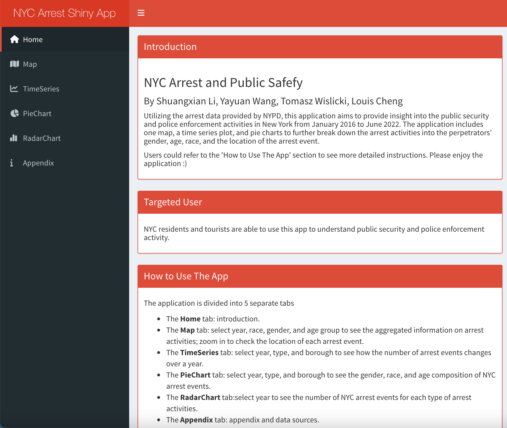

# Project 2: Shiny App Development

### [Project Description](doc/project2_desc.md)




## Project: NYPD Arrest Activities
Term: Fall 2022

+ Team # Group 10
+ **Crime Data Shiny app**:
	+ Cheng, Louis
	+ Li, Shuangxian
	+ Wang, Yayuan
	+ Wislicki, Tomasz

+ shiny link: https://wangyayuan.shinyapps.io/Arrest/ 

+ **Project summary**:
In New York, there are many criminals who are not arrested, which make the citizens and tourists very afraid. Besides, NYC government is committed to keep NYC safe enough for residents and tourists.

Utilizing the arrest data provided by NYPD, this application aims to provide insight into the public security and police enforcement activities in New York from January 2016 to June 2022. The application includes one map, a time series plot, and pie charts to further break down the arrest activities into the perpetrators' gender, age, race, and the location of the arrest event.

Our users are government, policemen,local residents and tourists. Through our app, residents and tourists can find different types of arrested criminals for every year and borough. It means people can keep away from some dangerous locations since we can find when and where criminals appeared possibly in the past 7 years using the app. The government can study how much the arrests affected  by different factors(age, gender, race, covid-19, borough) and determine how to change the situation.In addition, the police can predict when and where various criminals will appear. This can help them arrest criminals quickly.


+ **Contribution statement**: 

Yayuan and Shuangxian searched for and obtained datasets team used for the project, did data cleansing and preprocessing before analyzing the data

Shuangxian constructed the frame of the application page and she plotted the TimeSeries of  the number of crimes over 12 months for nyc arrest data from 2011 to 2022. The plot can change by specifying the year, crime type, and borough. She also plotted three different pie charts that detail the arrest demographics (sex, race, and age) by year, crime type, and borough.


Yayuan created and wrote up the Home and Appendix page which tell us how to use app and some intrudctions. She also designed the map to show the number of crimes over 12 months for nyc arrest data from 2016 to 2022. The plot can change by specifying the year, rice,gender and age. 

Shuangxian and Yayuan helped polish and improve the visualizations for each other.For example, Yayuan proposed for Shuangxian multivariate comparison of timeseries pairs and Shuangxian added a time variable to the map of Yayuan.

Tomasz and Louis designed the radar chart and integrated it in the UI. Both worked together to polish the visualizations and description for Home page.

Louis rearranged and organised the repo, resolving conflicts between files.

+ **Data source**: 
NYC Open Data:  
   + https://data.cityofnewyork.us/Public-Safety/NYPD-Arrests-Data-Historic-/8h9b-rp9u/data
   + https://data.cityofnewyork.us/Public-Safety/NYPD-Arrest-Data-Year-to-Date-/uip8-fykc

Following [suggestions](http://nicercode.github.io/blog/2013-04-05-projects/) by [RICH FITZJOHN](http://nicercode.github.io/about/#Team) (@richfitz). This folder is orgarnized as follows.

```
proj/
├── app/
├── lib/
├── data/
├── doc/
└── output/
```

Please see each subfolder for a README file.

